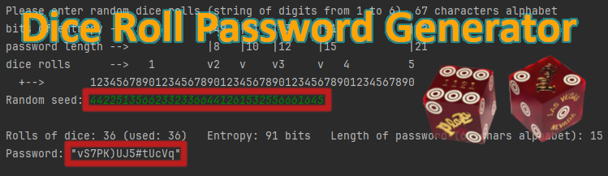
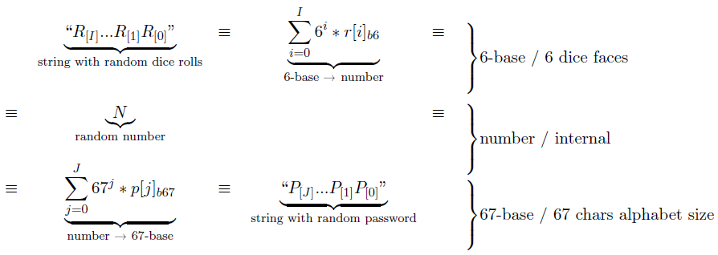
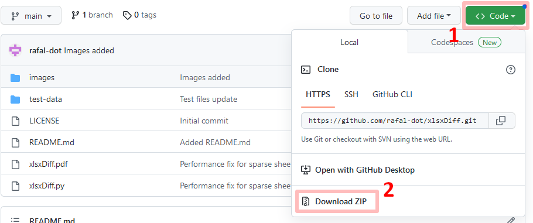

# `DiceRPG`


DiceRPG / "Dice Roll Password Generator" and DiceKeysAlike- dice rolls based,
easy to validate, generators of very strong random passwords

# INTRODUCTION

The need to create this script was driven by the desire to have high-quality
random passwords where I could physically "see" the source of the randomness,
be confident in how the password was created, and at the same time ensure ease
of use. While there are solutions such as EFF-generated passwords, I couldn't
find a solution to generate passwords similar to programs such as KeePass or
the latest Firefox (looking like `vS7PK)UJ5#tUcVq` for example). What was
important to me was the ease of verifying the program's logic.

## Concept description

### `DiceRPG`

This `DiceRPG` script is implementation of a simple concept:

1. There are random dice rolls, that can be represented as a string of "1"-"6"
   digits (6s are transfered to 0s BTW),

2. These random 6-base digits define a random number `N` and a random number is
   an abstract, regardless of its representation,

3. A random number `N` represented in 6-base is also random in 67-base, so its
   representation defines a set of random numbers/digits,

4. These random numbers/digits can be used as index to characters that can be
   used to define a random, human-readable password.



In real applications at least 20 (optimally ~30 or - for paranoiacs - 50+) dice
rolls should be used to ensure adequate password entropy/quality. For details
see one of the next chapters.

### `DiceKeysAlike`

`DiceKeysAlike` is much better when it comes to using dice rolls, because it
uses not only (i) dice faces, but also their (ii)  directions and (iii) order.
In short, this means that it takes slightly less than 3x dice rolls to generate
a password of similar quality than the case of `DiceRPG`. For passwords longer
than 8 characters, this is 1 dice roll or less per character of the password.
Documentation under construction.

# INSTALLATION

## FILES IN REPOSITORY

There are following files:

- [`DiceRPG.py`](DiceRPG.py) - main script, a single file,

- [`DiceKeysAlike.py`](DiceKeysAlike.py) - another version of the script, a
  single file, taking entropy not only from (i) the random faces of the dice
  (6^number of dices), but also from (ii) dice direction (4^number of dices)
  and (iii) their order (factorial from number of dices). Documentation
  "in progress" ;-)

- [`LICENCE`](LICENSE) - GNU Affero General Public License file,

- [`README.md`](README.md) - this documentation file.

## Download `DiceRPG`

To download `DiceRPG`, just do one of the following:

- download the compressed archive from the repository page
  [GitHub](https://github.com/rafal-dot/DiceRPG) (see `Code`/`Download ZIP`
  button):



or

- execute a `git clone`:

```commandline
git clone https://github.com/rafal-dot/DiceRPG.git
```

## Python download and installation

To avoid legal challenges, I suggest using the standard Python distribution,
which can be found at [https://www.python.org/downloads/windows/]

For any Unix distribution you probably already have Python installed.

I do not use macOS, but you can also find a distribution for this system.

On mobile devices I have successfuly tested this script with Pythonista/iOS and
Pydroid 3/Android.

# BASIC USE

## `DiceRPG`

Using `DiceRPG` is simple, just call the script:

```commandline
python DiceRPG.py
```

When you input `442251356623323366441261532556661645` result will be password
`vS7PK)UJ5#tUcVq`.

On Pythonista/iOS or Pydroid 3/Android code can be just pasted into IDE and
run.

## `DiceKeysAlike`

Using `DiceKeysAlike` is simple, just call the script:

```commandline
python DiceKeyAlike.py
```

When you input:
1. `251346414622` for dice faces,
2. `NNSNEEWEWSSE` for dice directions,
3. `3-11-6-12-10-5-8-7-1-9-4-2` for their order,
result will be password `SkAm)2dj#vT&q`.

# Entropy considerations

The table below summarizes the number of dice rolls necessary to draw a
password of a given length and the entropy depending on the size of the
alphabet:

| Pass length               | 45-chars alphabet / handwritten | 67-chars alphabet / machine storred, human retyped | 89-chars alphabet / machine storred, copy+paste |
|---------------------------|---------------------------------|----------------------------------------------------|-------------------------------------------------|
| ***8 chars***             | 17 rolls / 44 bits              | 19 rolls / 49 bits                                 | 21 rolls / 52 bits                              |
| ***10 chars***            | 22 rolls / 55 bits              | 24 rolls / 61 bits                                 | 26 rolls / 65 bits                              |
| ***12 chars***            | 26 rolls / 66 bits              | 29 rolls / 73 bits                                 | 31 rolls / 78 bits                              |

The table below summarizes password lengths and their entropy for the most
common numbers of dice rolls. It is worth paying attention to 36 dices, because
this is the number of elements in popular "12mm d6 dice block of 36 dices" set,
supplied by many dice manufacturers, and one roll of such dice set can generate
a single password:

| Dice rolls                 | 45-chars alphabet / handwritten | 67-chars alphabet / machine storred, human retyped | 89-chars alphabet / machine storred, copy+paste |
|----------------------------|---------------------------------|----------------------------------------------------|-------------------------------------------------|
| ***20 dices*** / ~50 bits  | 9 chars / 50 bits               | 8 chars / 49 bits                                  | 7 chars / 46 bits                               |
| ***25 dices*** / ~60 bits  | 11 chars / 61 bits              | 10 chars / 61 bits                                 | 9 chars / 59 bits                               |
| ***36 dices*** / ~90 bits  | 16 chars / 88 bits              | 15 chars / 91 bits                                 | 14 chars / 91 bits                              |
| ***50 dices*** / ~128 bits | 23 chars / 127 bits             | 21 chars / 128 bits                                | 19 chars / 124 bits                             |

Example: for 36 dice rolls `442251356623323366441261532556661645` as input, you
will receive as output 15 characters long, random, top quality password
`vS7PK)UJ5#tUcVq`.

If you expect particular password length, with proposed 45/67/89 characters
long alphabets, about 2.2 - 2.5 dice rolls is required per character. Remember
that the order of the dice should also be random. Just align them with your
hand/ruler/something straight while keeping the order random (don't sort
them!!!).

In 6-faces dice, the sum of the dots on opposite faces always adds up to 7. If
you start examining the probability distribution of your rolls, you will
certainly notice that for many of the dice available for board games, the
probability distribution is slightly biased. Many of them tend to be more
likely to draw lighter faces because the dice land on the heavier side. It's
only between fraction of percent point to a few percent points difference, but
the difference is noticeable (make 1000 throws and see for yourself). This
effect can be slightly reduced by the way dices are rolled. Gyroscopic effects
seem to affect distribution.

The effect described in previous paragraph is random in character and difficult
to exploit. However, if you're paranoid, use 19mm dice used in casinos that are
much, much better crafted and balanced. You can buy them on your favourite
e-commerce platform ;-)

# The implementation

Most programming languages has a limitation of the integer data type to a
maximum of several dozen bits. To convert large numbers between any number
systems, it is necessary to use specialized libraries  such as
[The GNU  Multiple Precision Arithmetic Library](https://gmplib.org/).
Libraries of this type contain very good quality aritmetic algorithms, but they
can be cumbersome to use. Fortunately, as of Python version 3, the only limit
to the size of integer data is the amount of available memory, so we can
implement the solution using native mechanisms of Python language.

## Base algorithm

Let's implement this conversion in Python 3.x. Constant `ALPHABET` contains
alphabet string, `ALPHABET_LEN` its length and variable `rolls` contains string
consisting of rolls digit characters. Output variable `password` contains
output password string:

```python
# Convert string of base-6 digits to integer
n = 0
for roll_char in rolls:
    n = 6 * n + (int(roll_char) % 6)

# Convert integer to its base-len(ALPHABET) number string
password = ""
while n > 0:
    password = ALPHABET[n % ALPHABET_LEN] + password
    n = n // ALPHABET_LEN
```

## Small improvements and ... _voilà_

There is only one remaining issue, that first char might not always use all of
its "power". We want each character in the password to have the same
probability of appearing. Except in trivial situations, the same number will
have different lengths in different number systems. We want to avoid a
situation where in the numerical system we use to represent a password, the
most significant digit has a distorted probability distribution. Therefore, if
the calculations show that we have such a situation, we cut off the most
significant digit. The password is then one character shorter, but each
character has the same probability distribution. So, to implement this, we
calculate a `effective_password_len` variable that allow to determine, which
number of significant characters from the point of randomness is efficent. So
finally the key part of the code looks like below:

```python
from math import floor, log

ALPHABET = "abcdefghijkmnopqrstuvwxyzABCDEFGHJKLMNPQRSTUVWXYZ23456789!@#$%&()/?"
ALPHABET_LEN = len(ALPHABET)

rolls = "442251356623323366441261532556661645"  # string with random rolls
effective_password_len = floor(len(rolls) * log(6) / log(ALPHABET_LEN))

# Convert string of base-6 digits to integer
n = 0
for roll_char in rolls:
    n = 6 * n + (int(roll_char) % 6)

# Convert integer to its base-len(ALPHABET) number string
password = ""
for _ in range(effective_password_len):
    password = ALPHABET[n % ALPHABET_LEN] + password
    n = n // ALPHABET_LEN
```

## Alternative characters sets

Base characters set, 67 characters
: for machine-storred, human-retyped passwords, common human-computer
ambiguities for non-proportional fonts removed (l/1/I, O/0, ;/:, ,/., ...)

```python
ALPHABET = "abcdefghijkmnopqrstuvwxyzABCDEFGHJKLMNPQRSTUVWXYZ23456789!@#$%&()/?"
```
```python
    print(f"""
Please enter random dice rolls (string of digits from 1 to 6), 67 characters alphabet
bits of entropy -->            |49  |61  |73    |91           |128
password length -->            |8   |10  |12    |15           |21
dice rolls      -->   1        v2   v    v3     v   4         5
  +-->       12345678901234567890123456789012345678901234567890""")
```

Alternative characters set #1, 89 characters
: for machine-storred, machine processed passwords (copy+paste)

```python
ALPHABET = "abcdefghijklmnopqrstuvwxyzABCDEFGHIJKLMNOPQRSTUVWXYZ0123456789!@#$%^&(){}[]<>,.:;/?*+-=_ "
```
```python
    print(f"""
Please enter random dice rolls (string of digits from 1 to 6), 89 characters alphabet
bits of entropy -->              |52  |65  |78  |91           |124
password length -->              |8   |10  |12  |14           |19
dice rolls      -->   1         2v    v   3v    v   4         5
  +-->       12345678901234567890123456789012345678901234567890""")

```

Alternative characters set #2, 45 characters
: for handwritten password, to avoid ambiguity when reading your hand-writing
after some time (l/1/I, b/6, 5/S, g/9, 2/Z, ...), you can use characters set
below. Due to smaller number of characters, using this set minimizes the risk
of misreading a manually written password, but - for the same entropy - increases
the length of the generated passwords:

```python
ALPHABET = "adefhijkmnprtwxyzAEFGHJKLMNPQRTXY347!@#$%&)/?"
```
```python
    print(f"""
Please enter random dice rolls (string of digits from 1 to 6), 45 characters alphabet
bits of entropy -->          |44  |55 |66       |88           |127
password length -->          |8   |10 |12       |16           |23
dice rolls      -->   1      v  2 v   v   3     v   4         5
  +-->       12345678901234567890123456789012345678901234567890""")
```

# FAQ

## How to use it securely?

Please note that every good quality and sophisticated software when generating
keys uses additional securit measures in place such as preventing the memory
being leaked (for example memory being swapped to the media storage) or
overwritting unused memory before freeing it, etc. So this method of generating
passwords is secure as long as you are able to ensure complete control over
computer/smart device, as one of main goals of this software was simplicity.

## Is this method fast enought?

Yes, even the extreme case of generating several thousends of characters long
passwords on smartphone should not take more than a few seconds.

## I generated password and it was rejected by service as too weak, without special characters. Why?

Base 67 characters alpahbet is like below:
```python
ALPHABET = "abcdefghijkmnopqrstuvwxyzABCDEFGHJKLMNPQRSTUVWXYZ23456789!@#$%&()/?"
```

So there are 10 special characters (`!@#$%&()/?`) out of 67 total characters.
During a single roll, there is a probability of 1-10/67 = ~85% that no special
character will be drawn.  After the next draw, the probability drops to ~73%
(~85%<sup>2</sup>). The important fact is that after drawing 10 characters,
there is still a ~20% probability (~85%<sup>10</sup>) that no special
characters will be drawn. So the conclusion is that among random passwords,
each one is equivalent. If a particular one has been rejected by your service,
you can (i) redo the roll, (ii) simply add new dice roll, (iii) modify one of
existing dice rolls, or (iii) simply add a required special character at the
end (as entropy is satisfied already).

## Are dices good source of randomness?

Quick answer is: 'yes' and 'no' ;-)

The coin flips are not "perfectly random":
[Fair coins tend to land on the same side they started: Evidence from 350,757 flips](https://arxiv.org/abs/2310.04153)

## Alternative dice-based password generation solutions

### Alternative #1: EFF Dice-Generated Passphrases

This solution is based on rolling the dice in sets by 5 rolls and - for each set -
selecting one of 7776 words (=6<sup>5</sup>) from a predefined wordlist. As it is easy to
calculate, each such set corresponds to approximately 13 bits of entropy. The
advantage of the solution is that it does not require a computer. The
disadvantage is that the generated passprases can be long.

So, for our set of test dice rolld `442251356623323366441261532556661645`
password generated using this method will be `pennant boneless dingo married
aware grappling washboard`. Despite being 50 characters long it is easier to
memorise than `vS7PK)UJ5#tUcVq` but it is almost 4 times longer than password
generated using method proposed by this script.

[EFF Dice-Generated Passphrases](https://www.eff.org/dice)

### Alternative #2: DiceKeys

Another alternative is DiceKeys. This solution uses specially prepared 25
6-face dices, where in addition to the random side generation after rolling of
deces (6<sup>25</sup> ~= 3 * 10 <sup>19</sup>), each dice is unique and its
order is taken into account (25! ~= 1.5 * 10 <sup>25</sup>) and its orientation
is taken into account (4<sup>25</sup> ~= 1 * 10 <sup>15</sup>). This gives a
total of less around 1.2 * 10 <sup>59</sup>. This is amazing, because it means
that the creators were able to squeeze 3 times more entropy from 25 dice rolls
than using the method I proposed. This solution, however, requires the purchase
of dedicated dices with box-frame, requires the use of dedicated software and
is basically limited only to generating one long-live pass-phase that can be
used to protect master-password.

[DiceKeys](https://dicekeys.com/)

# LICENCE

Copyright (C) 2021-2023 [Rafał Czeczótka](mailto:rafal_dot_czeczotka_at_gmail_dot_com)

This program is free software: you can redistribute it and/or modify it under
the terms of the GNU Affero General Public License as published by the Free
Software Foundation, either version 3 of the License, or (at your option) any
later version.

This program is distributed in the hope that it will be useful, WITHOUT ANY
WARRANTY; without even the implied warranty of MERCHANTABILITY or FITNESS FOR A
PARTICULAR PURPOSE. See the GNU Affero General Public License for more details.

You should have received a copy of the GNU Affero General Public License along
with this program. If not, see
[https://www.gnu.org/licenses/](https://www.gnu.org/licenses/).
